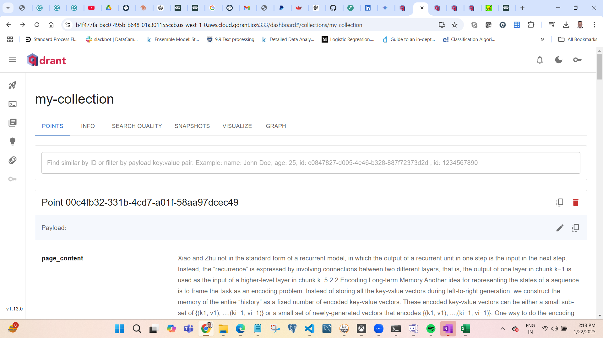
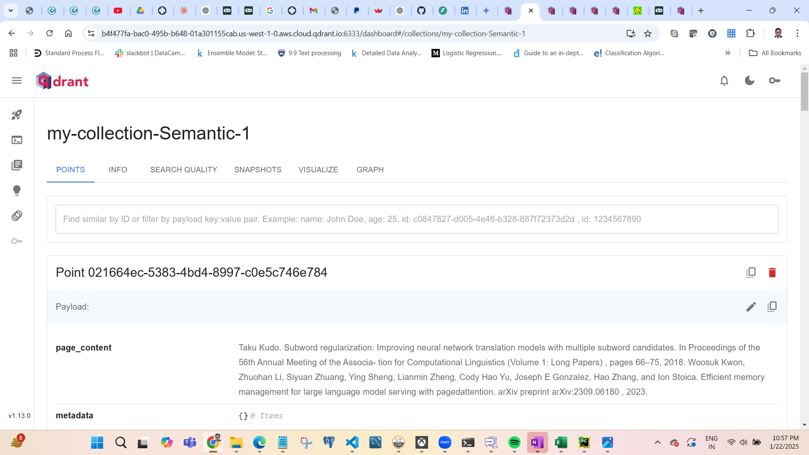

# LangchainQdrant
This repo is on understanding the Langchain and Qdrant uage

1. create the virtual environment: conda create -n langchainqdrant python=3.11 -y
2. conda activate langchainqdrant
3. pip install -r requirements.txt  (important packages included qdrant-client, pypdf, langchain_openai, beautifulsoup4, langchain)
4. Loading the packages
5. Loading the environment keys
6. client initialization (requires the Qdrant Endpoint and API KEYS)
7. create collection - This is like table in a database
8. define the vector config - this is in accordance with the embedding model and the similarity measure. Creating the collection require the collection name and the vector data base configuration
9. Load the document using pypdfloader from the langchain by creating the loading object and the loading it
10. Create the chunk using RecursiveCharacterTextSplitter by specifying the chunksize and the chunk overlap
11. Create the embedding
12. With the Vector store using the qdrant client object, collection name and the embedding
13. Add the document to the vector store

https://b4f477fa-bac0-495b-b648-01a301155cab.us-west-1-0.aws.cloud.qdrant.io:6333/dashboard#/collections/my-collection

14.  Specify the llm, query and create the retriever object for the vector db , specify them under the retrieval qa
15.  for the above object use the query to invoke
16.  You will get the response

# Semantic Splitting
1. Loading the Packages (
      1. Qrant - vectorstore, 
      2. OpenAI Embedding for creating embedding for chunked doc
      3. QdrantClient for using Qdrant with cloud
      4. pyPDF2 for reading the pdf file)\
2. Loading keys
3. Client initialization with URL and Key
4. Specifying the collection name for vector db table
5. content manager to read the pdf file and string joining to read the entire corpus
6. Using SemanticChunker and OpenAIEmbeddings to create the chunk
7. adding the chunk to the vector store

# pkg required
langchain_community
qdrant-client
python-dotenv
ipykernel
langchain_openai
langchain
beautifulsoup4 (not required)
langchain_qdrant
transformers (not required)
sentence-transformers (not required)
datasets (not required)
pypdf 
langchain_experimental
langchain-ai21 (not required)
PyPDF2

